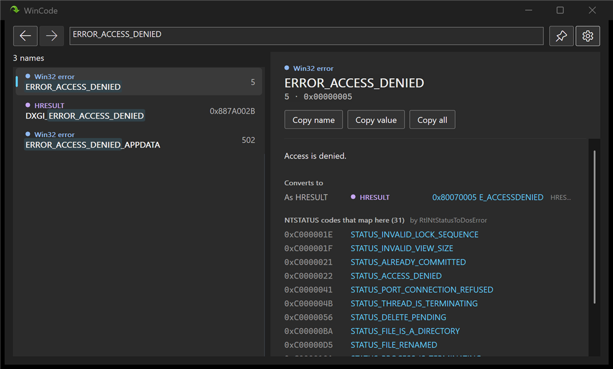
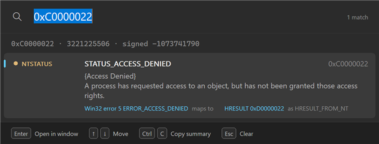
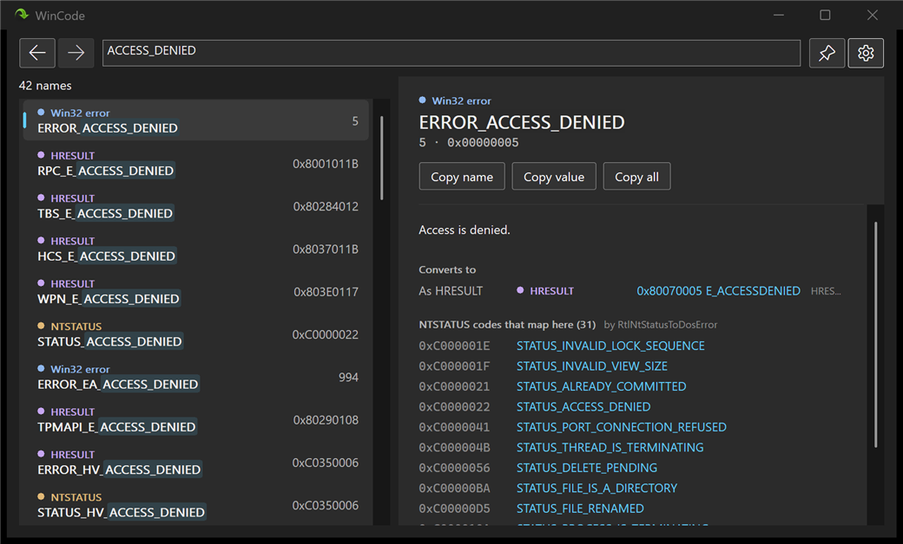

# WinCode

Looks up the numbers that turn up while debugging Windows or reading its logs, in
both user mode and kernel mode: Win32 errors, HRESULTs, NTSTATUS codes, bugchecks
and window messages. One value, every meaning it has, and the codes it converts
to.



## Downloads

From [Releases](https://github.com/gedmurphy/wincode/releases):

| File | For |
|---|---|
| `WinCode-<version>-setup.exe` | Installing per user, with no admin rights |
| `WinCode-<version>-x64.zip` | Running from anywhere: a VM, a test machine, a USB stick |

Neither is signed yet, so Windows warns about an unknown publisher the first time.

The installer puts WinCode in `%LOCALAPPDATA%\Programs\WinCode`, adds it to the
Start menu, and offers to put `wincode` on your PATH and to start WinCode when
you sign in. Uninstalling removes all of it and leaves your settings.

## The window

WinCode waits in the notification area so its hotkey always works. **Win+Shift+E**
opens the popup over whatever you're in, with the clipboard already looked up:



Enter opens the result in the window, Ctrl+C copies it as one line, and Esc
clears then closes. Closing the window hides it; Exit on the tray icon quits.

Every related code is a link. Following one is a new lookup, and Back and Forward
(or Alt+Left and Alt+Right) retrace your steps. Part of a name is enough to
search, and the part that matched is highlighted:



Settings, from the gear or the tray icon, change the hotkey, start WinCode at
sign-in, or clear recent lookups. They live in `settings.json`, beside the
executable if there's one there and in `%APPDATA%\WinCode` otherwise, so a copy
with its own settings file is portable. The theme follows Windows.

## The command line

```
wincode 0xC0000005
wincode -2147024891
wincode "CreateFile failed (HRESULT: 0x80070005)"
wincode ERROR_ACCESS_DENIED
wincode ACCESS_DENIED
```

```
> wincode 0xC0000005
0xC0000005  3221225477  (signed -1073741819)
  NTSTATUS        STATUS_ACCESS_VIOLATION
                  The instruction at 0x%p referenced memory at 0x%p. The memory could not be %s.
                  fields      error, facility 0x0 (0), code 0x0005 (5)
                  maps to     Win32 error 998 ERROR_NOACCESS (RtlNtStatusToDosError)
                  as HRESULT  0xD0000005 (HRESULT_FROM_NT)
```

It takes a value however a log or a debugger writes it: decimal, hex with or
without `0x`, negative decimals, sign-extended 64-bit values, C suffixes, and
codes wrapped in labels and punctuation. Eight decimal digits are read as decimal
and as hex, since that's a code with its `0x` dropped, and whichever means
something is shown.

Each value is looked up as every kind of code it could be, with its message from
this Windows, its fields, and its cross-references: as an HRESULT, the Win32
error an NTSTATUS maps to, the code inside an HRESULT, and for a Win32 error every
NTSTATUS that maps to it. That last one is many to one, and no other tool shows
it: 31 NTSTATUS codes become `ERROR_ACCESS_DENIED`.

A value in no table is still explained where its shape says something, such as an
HRESULT with a known facility or a message in the `WM_USER` range. Anything else
says "no match" rather than inventing a meaning.

Exit codes: 0 if anything matched, 1 if nothing did, 2 for a usage error.

## Building

Visual Studio 18 with the C++ desktop workload, plus the ARM64 build tools for
ARM64. No .NET, no third-party libraries.

```
cmake --preset x64
cmake --build --preset x64-debug
ctest --preset x64-debug
```

`cmake --build --preset x64-release --target installer` builds the installer and
the zip, which needs [Inno Setup](https://jrsoftware.org/isinfo.php).

| Path | What's in it |
|---|---|
| `Core/` | Parsing, lookup and decoding, with no UI |
| `Cli/` | `wincode.exe` |
| `Gui/` | `WinCodeUI.exe`: the popup, the window and the tray icon |
| `Tests/`, `tools/`, `installer/`, `docs/` | Tests, table generators, the installer script, and the plan |

The tables are generated from the Windows SDK headers by compiling a program that
includes them, so the compiler works out each value. They're committed, so an
ordinary build needs no SDK-specific step. Every binary links the C runtime
statically, so a single file runs on a bare machine.

## Licence

GPLv3 or later. See [LICENSE](LICENSE).
